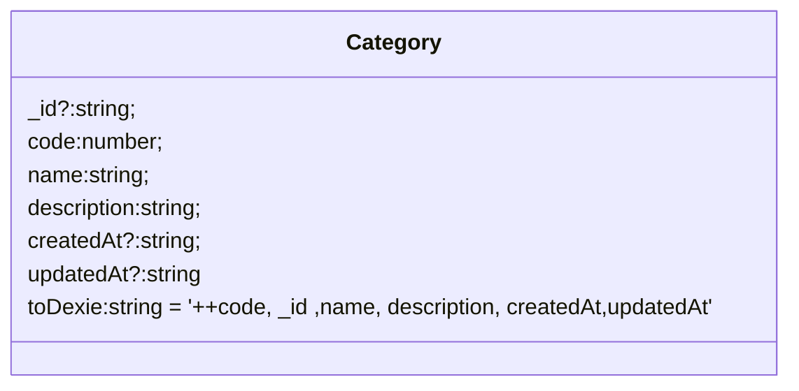

# Diagrama de Classes

OBS: Todas as entidades terão data de criação e data da última alteração controlados nativamente pelo banco de dados

```mermaid
classDiagram

class Category {
    _id?:string;
    code:number;
    name:string;
    description:string;
    createdAt?:string;
    updatedAt?:string
    toDexie:string = '++code, _id ,name, description, createdAt,updatedAt'
}

```
